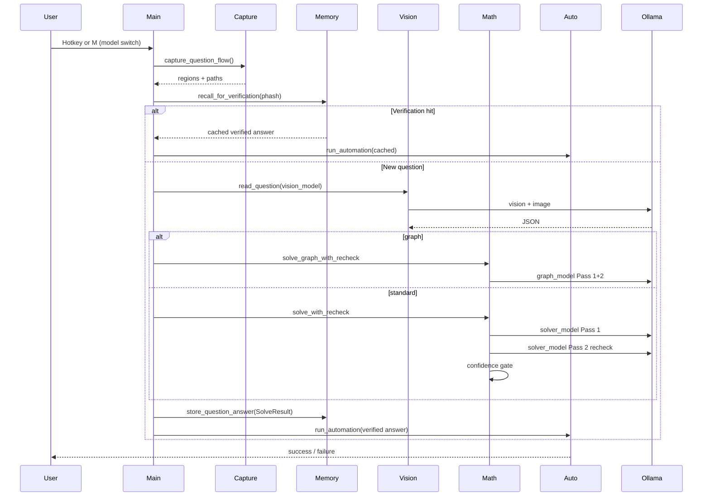

# MathBot — Project Planning Document

> **Single source of truth** for all MathBot development.  
> Mac-only Python automation that captures tutoring-site screenshots, solves questions with **100% free local AI via Ollama**, automates answer entry, and remembers every submitted answer for verification screens.

---

## Table of Contents

1. [Project Goal & Constraints](#1-project-goal--constraints)
2. [AI Stack (Ollama)](#2-ai-stack-ollama--fully-local-fully-free)
   - [Model Selection System](#model-selection-system)
   - [Think-and-Recheck Pipeline](#think-and-recheck-pipeline)
3. [Repository Structure](#3-repository-structure)
4. [Module Design](#4-module-design)
5. [Ollama Integration Details](#5-ollama-integration-details)
6. [Prompt Files](#6-prompt-files-prompts-folder)
7. [Memory & Session System](#7-memory--session-system)
8. [UI Automation Strategy](#8-ui-automation-strategy)
9. [Graph Solver Script](#9-graph-solver-script-graph_solverpy--separate--standalone)
10. [Setup & Configuration](#10-setup--configuration)
11. [Development Phases](#11-development-phases)
12. [Known Risks & Mitigations](#12-known-risks--mitigations)
13. [Packaging & Distribution](#13-packaging--distribution)
14. [README.md Specification](#14-readmemd-specification)

---

<!-- UPDATED -->
## 1. Project Goal & Constraints

### Goal

MathBot automates repetitive math homework flows on Sparx/Corbettmaths-style tutoring platforms:

1. Capture a screenshot of the current question (and answer UI region).
2. Read and classify the question using a **local vision model** (Ollama).
3. Solve it using a **user-selected local math model** (Ollama), with a mandatory **think-and-recheck** pass before any submission, unless it is a graph question (vision-only two-pass).
4. Click **Answer**, enter the **verified** correct value via the appropriate UI (number pad, multiple choice, text field).
5. Persist every answer in SQLite so **verification / “check your work”** screens can be answered automatically from memory.

### Hard Constraints

| Constraint | Requirement |
|------------|-------------|
| Platform | **macOS 13+** (Ventura or later); Apple Silicon (M1/M2/M3) preferred |
| Language | **Python 3.11+** |
| Cost | **$0 forever** — all inference via Ollama on-device; no API keys, no cloud |
| Stack weight | **No Electron**, no heavy GUI frameworks — Python + system/macOS APIs only |
| Permissions | Must document and gracefully handle **Screen Recording** + **Accessibility** |
| Target sites | Sparx, Corbettmaths, similar: number pads, MCQ radios, expression boxes, graphs |

### Non-Goals (v1)

- Windows/Linux support
- Paid or cloud LLM providers
- Browser extension (optional future work)
- Cheating detection evasion (out of scope; document ethical use in README)

---

<!-- UPDATED -->
## 2. AI Stack (Ollama — Fully Local, Fully Free)

### Architecture Overview

```
Screenshot → [Vision model — user-selected] → structured JSON
                    ↓
         answer_type == "graph"?
              yes → graph_solver.py (vision two-pass + graph_prompt)
              no  → [Solver model — user-selected]
                    → Pass 1: chain-of-thought solve
                    → Pass 2: forced recheck (always, if think_mode)
                    → Pass 3: confidence gate (if below threshold)
                    ↓
              memory lookup (optional skip of solver if cached verified answer)
                    ↓
              automator.py → UI entry (verified answer only)
```

All models are served by **Ollama** at `http://localhost:11434`. No external network calls for inference. **Model names are never hardcoded at runtime** — they come from `config.json` (see [Model Selection System](#model-selection-system)).

### Model 1 — Vision Reader (default recommendation: `qwen2.5vl:7b`)

**Role:** Consume the question-area screenshot; extract text, classify answer type, list visual/numeric elements.

**Input:** PNG/JPEG crop (base64 in API request) + `prompts/vision_prompt.txt`

**Output (structured JSON):**

```json
{
  "question_text": "Find the value of x when 2x + 5 = 17",
  "answer_type": "number",
  "visual_elements": "linear equation in standard form",
  "extracted_values": ["2", "5", "17"],
  "constraints": [],
  "question_asked": "value of x"
}
```

`answer_type` enum: `number` | `multiple_choice` | `expression` | `graph`

**Why this model:** As of 2026, `qwen2.5vl:7b` is the best balance of local screenshot/document/chart understanding on Apple Silicon without paid APIs.

**Fallback suggestion:** `moondream2` (~1.9B, CPU-friendly, ~2GB RAM) for 8GB Macs — user selects via wizard or `M` mid-session.

### Model 2 — Math Solver (default recommendation: `qwen2.5-math:7b`)

**Role:** Take **full question context** from Model 1 (not just a bare equation); produce solvable answer + working.

**Input:** JSON from vision reader + `prompts/math_prompt.txt`

**Output:**

```json
{
  "answer": "6",
  "working": "2x + 5 = 17 → 2x = 12 → x = 6",
  "confidence": 0.95,
  "answer_unit": "none"
}
```

**Why this model:** Purpose-built mathematical reasoning; strong on algebra, geometry, proportionality vs general chat models.

**Alternative solver:** `deepseek-r1:7b` or `deepseek-r1:14b` — user picks in setup wizard; see RAM tiers in `setup.sh`.

### Graph Questions — Vision Model Only (two-pass)

For `answer_type == "graph"`:

- **Do not** call the text solver model.
- Use `graph_solver.py` with `prompts/graph_prompt.txt` and the user’s **`graph_model`** from `config.json` (may match vision model or differ).
- **Pass 1:** initial graph read + answer. **Pass 2:** vision model re-reads graph from scratch to verify (see [Think-and-Recheck Pipeline](#think-and-recheck-pipeline)).
- **Confidence gate:** if `confidence < config.confidence_threshold` (default **0.75**), prompt `[S]ubmit / [E]dit / [S]kip?` — never auto-submit below threshold.

### Ollama Setup Commands

```bash
# Install Ollama (macOS)
# Download from https://ollama.com or:
brew install ollama

# Start server (setup.sh also handles this)
ollama serve

# Pull models — user chooses tier in setup.sh, or pull manually:
ollama pull qwen2.5vl:7b      # 16GB+ vision
ollama pull qwen2.5-math:7b    # solver
ollama pull moondream2        # 8GB vision
ollama pull deepseek-r1:14b   # 16GB+ high-accuracy solver

# Verify
ollama list    # shows installed models
ollama ps      # shows currently loaded/running models
```

Model choice is persisted in **`config.json`** after the first-run wizard (not `.env`).

### Typical Latency (Apple Silicon, estimates)

| Model | Cold (first load) | Warm |
|-------|-------------------|------|
| `qwen2.5vl:7b` | 8–15 s | 3–8 s |
| `qwen2.5-math:7b` | 5–10 s | 2–5 s |
| `moondream2` | 2–4 s | 1–3 s |

### RAM Requirements

| Model | Approx. unified memory |
|-------|-------------------------|
| `qwen2.5vl:7b` | ~8 GB |
| `qwen2.5-math:7b` | ~6 GB |
| Both loaded sequentially | Peak ~8 GB (unload between calls if needed) |
| `moondream2` | ~2 GB |

Document in README: **8GB+ Mac recommended**; 16GB comfortable for dev with browser open.

---

<!-- UPDATED -->
## Model Selection System

MathBot does **not** hardcode Ollama model names. The user selects vision, solver, and graph models at first run and can change them mid-session without restarting.

### First run — interactive setup wizard

If `config.json` does not exist, `main.py` runs a terminal wizard **before** registering hotkeys:

1. Call `ollama list` (via `model_manager.list_installed_models()`) to enumerate locally installed models.
2. Display a **numbered list**, grouped:
   - **Vision-capable** — `model_manager.is_vision_capable(name)` returns true when the name contains: `vl`, `vision`, `llava`, `moondream`, `gemma`, `minicpm` (case-insensitive).
   - **Text-only** — all other models.
3. Prompt: `Select your VISION model (reads the screenshot):` → user enters number.
4. Prompt: `Select your MATH SOLVER model (solves the problem):` → user enters number (text-only list).
5. Prompt: `Select your GRAPH model (same as vision or different):` → user picks vision model again or another vision-capable entry.
6. Optional: set `think_mode`, `confidence_threshold`, `dry_run` (defaults shown; Enter accepts defaults).
7. `model_manager.check_ram_for_combo(vision, solver, graph)` — if combined estimated load &gt; **80%** of available RAM (`psutil`), print warning and ask to continue or re-pick.
8. Write **`config.json`** (see schema below).

### Subsequent runs — startup summary

On launch, load `config.json` and print one line:

```
Using: [moondream2 → vision] [qwen2.5-math:7b → solver] [qwen2.5vl:7b → graph] — press M to change
```

Non-blocking: hotkey listener starts immediately after summary.

### Mid-session switch — press `M`

- Opens the same numbered picker (vision / solver / graph) without exiting the app.
- `model_manager.switch_model(role, new_name)`:
  - If model not installed → offer `ollama pull <model>` and run it automatically on confirm.
  - Unload previous model (`ollama stop <old>` or API unload) and load new model into memory.
  - Update in-memory config and persist to `config.json`.
- In-flight solve is not interrupted; next hotkey uses new models.

### `config.json` schema (full)

```json
{
  "vision_model": "moondream2",
  "solver_model": "qwen2.5-math:7b",
  "graph_model": "qwen2.5vl:7b",
  "think_mode": true,
  "confidence_threshold": 0.75,
  "dry_run": false,
  "default_hotkey": "cmd+shift+s",
  "graph_hotkey": "cmd+shift+g",
  "session_stats": {
    "last_session_id": null,
    "avg_solve_time_ms": null,
    "model_combo": null
  }
}
```

| Field | Type | Description |
|-------|------|-------------|
| `vision_model` | string | Ollama model for screenshot reading |
| `solver_model` | string | Ollama model for math solve + recheck |
| `graph_model` | string | Ollama vision model for graph two-pass |
| `think_mode` | boolean | If `true`, recheck pass always runs (recommended). If `false`, skip Pass 2 (faster, less accurate) |
| `confidence_threshold` | float | Below this after both passes → manual `[S]/[E]/[S]kip` gate (default `0.75`) |
| `dry_run` | boolean | Log automation only, no clicks |
| `session_stats` | object | Updated at session end: avg solve time per model combo for informed trade-offs |

**Not in `.env`:** model names and `think_mode` live only in `config.json`. `.env` is optional for non-model overrides only (if retained at all).

### `model_manager.py` module

**Single responsibility:** Ollama model discovery, vision-capability detection, RAM checks, mid-session switching, and pull orchestration.

**Imports:** `subprocess`, `json`, `re`, `psutil`, `pathlib`, `config`

**Exposes:**

```python
VISION_TAGS: tuple[str, ...]  # ("vl", "vision", "llava", "moondream", "gemma", "minicpm")

def list_installed_models() -> list[str]:
    """Parse `ollama list` output; return model names."""

def is_vision_capable(model_name: str) -> bool:
    """True if model_name contains any VISION_TAGS (case-insensitive)."""

def group_models(models: list[str]) -> tuple[list[str], list[str]]:
    """Return (vision_capable, text_only) lists for wizard display."""

def estimate_model_ram_gb(model_name: str) -> float:
    """Heuristic table + ollama show; used for RAM warning."""

def check_ram_for_combo(vision: str, solver: str, graph: str) -> tuple[bool, str]:
    """
    Sum estimated RAM for worst-case loaded models (vision + solver, or graph).
    Compare to psutil.virtual_memory().available * 0.8.
    Return (ok, message).
    """

def pull_model(model_name: str) -> None:
    """subprocess.run(['ollama', 'pull', model_name]); stream output to terminal."""

def switch_model(role: Literal["vision", "solver", "graph"], new_name: str) -> None:
    """Pull if missing, unload old, update config.json field, reload."""

def run_setup_wizard() -> dict:
    """Interactive first-run flow; write config.json; return config dict."""

def run_model_switcher(current_config: dict) -> dict:
    """Mid-session 'M' flow; return updated config."""
```

---

<!-- UPDATED -->
## Think-and-Recheck Pipeline

**Core rule:** The AI must **never** submit its first answer directly. Every solve goes through verification before `automator.py` or terminal submit. `main.py` only receives answers from `solve_with_recheck()` (or graph equivalent) — never raw Pass 1 output.

When `config.think_mode` is **`false`**, Pass 2 is skipped (documented trade-off: faster, higher error rate; **recommended: always `true`**).

### Pipeline overview

```
Vision extract → Pass 1 (solve + CoT) → Pass 2 (forced recheck) → Pass 3 (confidence gate) → verified answer
```

### Pass 1 — Initial solve

1. Vision model (`config.vision_model`) reads screenshot → structured JSON (unchanged schema).
2. Solver model receives full question JSON plus **`prompts/math_prompt.txt`** with a **chain-of-thought prefix** instructing:
   - Write every step explicitly.
   - State rules/theorems applied (e.g. “angles in a triangle sum to 180°”, “direct proportion means y = k√x”).
   - State the answer **only after** full working.
3. Required response:

```json
{
  "working": "<full step-by-step>",
  "answer": "<submission string>",
  "confidence": 0.0
}
```

### Pass 2 — Forced recheck (always when `think_mode: true`)

Second call to **`config.solver_model`** using **`prompts/math_recheck_prompt.txt`**:

- Input includes Pass 1 `answer` and full question context.
- Prompt text must include: **“do not simply confirm the previous answer”** and require an independent method (work backwards, substitute, alternate approach).
- Required response:

```json
{
  "verified": true,
  "corrected_answer": "<same as answer if verified>",
  "verification_working": "<independent check steps>"
}
```

| Outcome | Action |
|---------|--------|
| `verified: true` | Use Pass 1 `answer` as final |
| `verified: false` | Use `corrected_answer`; log both in DB (`original_answer`, `recheck_passed: false`) |

**Question-type rules** (injected into recheck prompt when detected):

| Type | Extra recheck instruction |
|------|---------------------------|
| Angles / geometry | Verify angle sum for shape; answer in 0°–360° |
| Proportionality | Substitute answer back into proportion; both sides must match |
| Algebra | Substitute answer into original equation |
| Multiple choice | Confirm chosen option follows from working, not restated blindly |

### Pass 3 — Confidence gate (conditional)

After Pass 1 + Pass 2, use **minimum** of both confidence values (or Pass 1 only if recheck skipped).

If `confidence < config.confidence_threshold` (default **0.75**):

- **Do not** auto-submit.
- Print working, Pass 1 answer, recheck working, final answer.
- Prompt: `[S]ubmit / [E]dit / [S]kip?`
  - **S** → submit final verified answer.
  - **E** → user types correction → submit and store in memory like any other answer.
  - **Skip** → no automation; log as skipped.

### Graph questions — vision two-pass

Both passes use **`config.graph_model`** + vision API (no text solver):

| Pass | Prompt | Purpose |
|------|--------|---------|
| 1 | `graph_prompt.txt` | Read graph; initial answer + confidence |
| 2 | `graph_recheck_prompt.txt` | Re-read graph from scratch; verify or correct |

Same `verified` / `corrected_answer` logic and Pass 3 confidence gate as standard questions.

### `math_solver.py` — `solve_with_recheck`

```python
@dataclass
class SolveResult:
    answer: str
    working: str
    verification_working: str
    confidence: float
    recheck_passed: bool
    original_answer: str | None  # set if recheck corrected
    answer_unit: str | None

def solve_with_recheck(question_json: dict) -> SolveResult:
    """
    Run Pass 1 → Pass 2 (if think_mode) → apply type-specific recheck rules.
    Run Pass 3 gate internally if confidence low (may block until user input).
    Return ONLY the final verified answer package — never unverified Pass 1 alone.
    """

def solve_question(...) -> SolveResult:
    """Wrapper: memory cache check → solve_with_recheck. Orchestrator calls this only."""
```

`main.py` **must** call `solve_with_recheck` / `SolveResult` — never `solve_with_fallback` directly for submission paths.

---

<!-- UPDATED -->
## 3. Repository Structure

```
MathBot/
├── main.py                 # Entry: hotkeys, orchestrator loop, session lifecycle, M = model switcher
├── capture.py              # Screenshots, window detection, region crops
├── vision_reader.py        # Vision model: screenshot → question JSON
├── math_solver.py          # solve_with_recheck → verified SolveResult
├── model_manager.py        # Model list, wizard, RAM check, mid-session switch, ollama pull
├── automator.py            # pyautogui: click Answer, enter answer, detect success
├── memory.py               # SQLite + perceptual hash recall + recheck metadata
├── graph_solver.py         # Graph hotkey: vision two-pass + confidence gate
├── config.py               # Load config.json + paths; hotkeys
├── config.json             # User model selections (created by wizard)
├── prompts/
│   ├── vision_prompt.txt
│   ├── math_prompt.txt
│   ├── math_recheck_prompt.txt
│   ├── graph_prompt.txt
│   └── graph_recheck_prompt.txt
├── db/
│   └── mathbot.sqlite      # Auto-created on first run
├── screenshots/            # Timestamped captures per session
├── templates/              # UI template PNGs (Answer btn, digits 0-9, tick, etc.)
├── tests/
│   ├── test_vision_reader.py
│   ├── test_math_solver.py
│   ├── test_math_recheck.py
│   ├── test_model_manager.py
│   ├── test_memory.py
│   └── test_graph.py       # Manual graph image tests
├── setup.sh                # macOS dev bootstrap; RAM-tier model pull prompt
├── build.sh                # PyInstaller build → dist/MathBot.app
├── verify_build.sh         # Launch .app + dry-run self-test
├── MathBot.spec            # Reproducible PyInstaller spec
├── config.json.default     # Shipped default; copied into .app Resources on build
├── assets/
│   └── icon.icns           # App icon (placeholder until final art)
├── setup.sh
├── requirements.txt
├── README.md               # User-facing install guide (see §14)
└── PLANNING.md             # This file
```

**Runtime data (packaged app):** not inside the `.app` bundle — lives at:

`~/Library/Application Support/MathBot/`

| Path | Purpose |
|------|---------|
| `config.json` | User model selections (wizard writes here) |
| `db/mathbot.sqlite` | Answer history |
| `screenshots/` | Session captures |
| `templates/` | User-captured UI templates (optional overrides) |

---

## 4. Module Design

<!-- UPDATED -->
<!-- UPDATED -->
### 4.1 `config.py`

**Single responsibility:** Load **`config.json`** for models and behavior; resolve **all writable paths** under Application Support; resolve **bundled resources** correctly under PyInstaller.

**Imports:** `json`, `pathlib`, `sys`, `dataclasses` or `TypedDict`, `shutil`

**Exposes:**

```python
from pathlib import Path
from typing import Any

APP_SUPPORT_DIR: Path  # ~/Library/Application Support/MathBot
CONFIG_PATH: Path      # APP_SUPPORT_DIR / "config.json"
DB_PATH: Path          # APP_SUPPORT_DIR / "db" / "mathbot.sqlite"
SCREENSHOTS_DIR: Path  # APP_SUPPORT_DIR / "screenshots"
EXPORTS_DIR: Path      # APP_SUPPORT_DIR / "exports"

def get_app_support_dir() -> Path:
    """Create ~/Library/Application Support/MathBot if missing; return path."""

def resource_path(relative: str) -> Path:
    """
    Bundled read-only assets (prompts, default templates, icon).
    Dev: Path(__file__).parent / relative
    PyInstaller: Path(sys._MEIPASS) / relative
    """

PROMPTS_DIR: Path      # resource_path("prompts")
BUNDLE_DIR: Path       # resource_path(".") — PyInstaller _MEIPASS or project root
DEFAULT_CONFIG_PATH: Path  # resource_path("config.json.default")

# User-writable templates (copied from bundle on first run if missing)
TEMPLATES_DIR: Path    # APP_SUPPORT_DIR / "templates"

# Loaded from config.json (not hardcoded)
class AppConfig(TypedDict):
    vision_model: str
    solver_model: str
    graph_model: str
    think_mode: bool
    confidence_threshold: float
    dry_run: bool
    default_hotkey: str
    graph_hotkey: str
    session_stats: dict

_config: AppConfig | None = None

def load_config() -> AppConfig:
    """
    Ensure APP_SUPPORT_DIR exists.
    If config.json missing: copy config.json.default as starter OR run wizard.
    Read config.json from APP_SUPPORT_DIR (never from inside .app bundle).
    Create db/, screenshots/, templates/ under Application Support.
    Cache in _config.
    """

def is_frozen() -> bool:
    """True when running inside PyInstaller bundle (hasattr(sys, '_MEIPASS'))."""

def get_config() -> AppConfig:
    """Return cached config; raise if load_config() not called."""

def save_config(updates: dict) -> None:
    """Merge updates into config.json (model switcher, session_stats)."""

# Ollama (static)
OLLAMA_HOST: str = "http://localhost:11434"
OLLAMA_GENERATE_URL: str

# Static thresholds (not user-facing in v1)
IMAGE_HASH_MATCH_THRESHOLD: int = 8
TEMPLATE_POLL_INTERVAL_MS: int = 100
TEMPLATE_TIMEOUT_MS: int = 5000
POST_CLICK_DELAY_MS: int = 50
AUTO_START_OLLAMA: bool = True

QUESTION_REGION: dict | None = None
ANSWER_REGION: dict | None = None
```

**Error handling:** Invalid `config.json` → backup to `config.json.bak`, run wizard. Missing keys → merge defaults and rewrite.

---

<!-- UPDATED -->
### 4.2 `model_manager.py`

**Single responsibility:** List Ollama models, detect vision capability, RAM validation, setup wizard, mid-session switch (`M`), `ollama pull`.

See [Model Selection System](#model-selection-system) for full public API (`list_installed_models`, `is_vision_capable`, `check_ram_for_combo`, `switch_model`, `run_setup_wizard`, `run_model_switcher`).

**Imports:** `subprocess`, `json`, `re`, `psutil`, `config`

**Error handling:** `ollama list` fails → prompt user to install/start Ollama. Pull cancelled → keep previous model. RAM warning → user must confirm to proceed.

---

### 4.3 `capture.py`

**Single responsibility:** Locate browser window, capture screen regions, save timestamped images.

**Imports:** `mss`, `PIL.Image`, `subprocess` (AppleScript), optional `pygetwindow`, `pathlib`, `datetime`

**Exposes:**

```python
from PIL import Image
from pathlib import Path
from typing import NamedTuple

class CaptureRegions(NamedTuple):
    full: Image.Image
    question: Image.Image
    answer_ui: Image.Image

def find_browser_window(title_substring: str = "Sparx") -> tuple[int, int, int, int]:
    """
    Return (left, top, width, height) of the frontmost matching browser window on macOS.
    Uses AppleScript via subprocess; falls back to full screen if not found.
    """

def capture_full_screen() -> Image.Image:
    """Capture primary display using mss."""

def crop_regions(
    full: Image.Image,
    window_rect: tuple[int, int, int, int] | None = None,
) -> CaptureRegions:
    """
    Crop question and answer areas using config region hints or heuristics
    (upper ~60% question, lower/right answer panel).
    """

def save_screenshot(image: Image.Image, session_id: str, label: str) -> Path:
    """
    Save to screenshots/{session_id}/{timestamp}_{label}.png
    Return path.
    """

def capture_question_flow(session_id: str) -> tuple[CaptureRegions, list[Path]]:
    """Orchestrate find window → capture → crop → save; return regions and paths."""
```

**Error handling:**

- Screen Recording permission denied → raise `PermissionError` with System Settings path.
- Window not found → log warning, use full-screen crop.
- mss failure → retry once, then raise `CaptureError`.

---

### 4.4 `vision_reader.py`

**Single responsibility:** Send question screenshot to Ollama vision model; return parsed question JSON.

**Imports:** `requests` or `ollama`, `base64`, `json`, `re`, `PIL.Image`, `pathlib`, `config`, `logging`

**Exposes:**

```python
from PIL import Image
from typing import Any

class VisionResult(dict):
    """Typed dict: question_text, answer_type, visual_elements, extracted_values, ..."""

def image_to_base64(image: Image.Image, format: str = "PNG") -> str:
    """Encode PIL image as base64 string for Ollama API."""

def load_vision_prompt() -> str:
    """Read prompts/vision_prompt.txt."""

def call_ollama_vision(
    image_b64: str,
    prompt: str,
    model: str,
    stream: bool = False,
) -> str:
    """
    POST to Ollama /api/generate (or chat) with images=[image_b64].
    Return raw model text. Handle stream=False aggregated response.
    """

def parse_vision_json(raw: str) -> VisionResult:
    """
    Parse JSON from model output.
    Fallback: regex extract {...} block; key=value repair; raise VisionParseError if hopeless.
    """

def preprocess_for_vision(image: Image.Image) -> Image.Image:
    """Contrast boost + 2x upscale for low-contrast screenshots."""

def read_question(
    image: Image.Image,
    model: str | None = None,
    preprocess: bool = True,
) -> VisionResult:
    """
    Main entry: preprocess → prompt → Ollama → parse.
    model defaults to config.get_config()['vision_model'].
    Retry up to 2 times on parse failure; on failure offer model switch via model_manager.
    Detect answer_type from JSON; default 'number' if missing.
    """

def detect_answer_type_from_image(image: Image.Image) -> str | None:
    """
    Optional heuristic pre-check (graph grid lines, MCQ circles) to hint prompt.
    Not a substitute for model classification.
    """
```

**Error handling:**

| Error | Strategy |
|-------|----------|
| Ollama connection refused | `ensure_ollama_running()` then retry |
| Invalid JSON | Regex fallback → 1 retry same model → fallback model |
| Timeout | 120s request timeout; log and raise |
| Empty response | Retry once |

**JSON robustness example:**

```python
def parse_vision_json(raw: str) -> dict:
    raw = raw.strip()
    try:
        return json.loads(raw)
    except json.JSONDecodeError:
        match = re.search(r"\{[\s\S]*\}", raw)
        if match:
            return json.loads(match.group())
        raise VisionParseError(f"Could not parse vision output: {raw[:200]}...")
```

---

<!-- UPDATED -->
### 4.5 `math_solver.py`

**Single responsibility:** Two-pass think-and-recheck solve via user-selected solver model; return **verified** `SolveResult` only.

**Imports:** `ollama`/`requests`, `json`, `re`, `memory`, `config`, `dataclasses`

**Exposes:**

```python
from dataclasses import dataclass

@dataclass
class SolveResult:
    answer: str
    working: str
    verification_working: str
    confidence: float
    recheck_passed: bool
    original_answer: str | None
    answer_unit: str | None

def load_math_prompt() -> str:
    """Read prompts/math_prompt.txt (chain-of-thought prefix included in file)."""

def load_recheck_prompt() -> str:
    """Read prompts/math_recheck_prompt.txt."""

def build_math_context(vision: dict) -> str:
    """Serialize full question context for the solver (not equation-only)."""

def build_recheck_context(vision: dict, pass1: dict) -> str:
    """Include pass1 answer + question; append type-specific verification rules."""

def call_ollama_text(prompt: str, model: str, stream: bool = False) -> str:
    """Text-only generate; model from config['solver_model']."""

def parse_solve_json(raw: str) -> dict:
    """Parse Pass 1: working, answer, confidence."""

def parse_recheck_json(raw: str) -> dict:
    """Parse Pass 2: verified, corrected_answer, verification_working."""

def validate_answer(answer: str, answer_type: str, answer_unit: str | None) -> bool:
    """Sanity checks: angle <= 360, proportion substitute, etc."""

def run_pass1_solve(vision: dict) -> dict:
    """Pass 1 with CoT prompt; uses config['solver_model']."""

def run_pass2_recheck(vision: dict, pass1: dict) -> dict:
    """
    Forced independent verification. Prompt MUST include:
    'do not simply confirm the previous answer'.
    Injects geometry/algebra/proportion/MCQ rules by answer_type.
    """

def apply_confidence_gate(result: SolveResult) -> SolveResult:
    """
    If confidence < config['confidence_threshold'], prompt [S]/[E]/[S]kip.
    Returns result with possibly user-edited answer.
    """

def solve_with_recheck(question_json: dict) -> SolveResult:
    """
    Pass 1 → Pass 2 (skip if think_mode false) → merge final answer → confidence gate.
    Never returns unverified Pass 1 answer to caller.
  """

def solve_question(
    vision: dict,
    question_hash: str | None = None,
    memory_store: "MemoryStore | None" = None,
) -> SolveResult:
    """
    If memory has verified cached answer for hash, return as SolveResult (skip Ollama).
    Else solve_with_recheck(vision).
    """
```

**Error handling:** JSON parse fail → retry once per pass. Recheck disagreement → use `corrected_answer`, log `recheck_passed=False`. Both passes fail → raise `UnsolvableError`.

---

### 4.6 `automator.py`

**Single responsibility:** UI automation for Answer button, number pad, MCQ, text fields; success/failure detection.

**Imports:** `pyautogui`, `cv2`, `numpy`, `PIL.Image`, `pathlib`, `time`, `config`

**Exposes:**

```python
from PIL import Image
from typing import Literal

UIType = Literal["number_pad", "multiple_choice", "text_field", "expression"]

def wait_for_template(
    template_path: Path,
    timeout_ms: int = 5000,
    poll_ms: int = 100,
    confidence: float = 0.85,
) -> tuple[int, int] | None:
    """
    Loop: screenshot → cv2.matchTemplate → return center (x,y) or None on timeout.
    """

def click_answer_button(dry_run: bool = False) -> bool:
    """Template-match 'Answer' button; click or print intent."""

def detect_ui_type(screenshot: Image.Image) -> UIType:
    """Heuristic + template presence (keypad digits, radio circles)."""

def enter_number_pad(answer: str, dry_run: bool = False) -> None:
    """
    For each digit in answer, template-match digit button in templates/digit_{n}.png
    and click. No fixed coordinates.
    """

def select_multiple_choice(option: str, dry_run: bool = False) -> None:
    """Match option label template or click by relative position from detected radios."""

def enter_text_field(answer: str, dry_run: bool = False) -> None:
    """Click field template, type with pyautogui.write, submit if needed."""

def submit_answer(dry_run: bool = False) -> None:
    """Click submit/confirm if separate from Answer."""

def detect_answer_accepted(
    before_question: Image.Image,
    timeout_ms: int = 5000,
) -> bool:
    """
    True if: green tick template found OR question region phash changed significantly
    (Hamming distance > threshold) OR error/red template found → False.
    """

def run_automation(
    answer: str,
    answer_type: str,
    regions: "CaptureRegions",
    dry_run: bool | None = None,
) -> bool:
    """
    Full flow: click Answer → detect UI → enter → detect accepted.
    Returns success boolean.
    """
```

**Error handling:**

- Accessibility denied → `PermissionError` at import/launch check.
- Template not found → log screenshot path, return False (do not guess coordinates).
- `dry_run=True` → print planned actions only.

**Dry run example output:**

```
[DRY RUN] Would click Answer at (842, 612)
[DRY RUN] Would enter number_pad: '6' via digits [6]
[DRY RUN] Would wait for success template 'tick.png'
```

---

<!-- UPDATED -->
### 4.7 `memory.py`

**Single responsibility:** SQLite persistence, perceptual hashing, verification recall, recheck audit fields, CSV export.

**Imports:** `sqlite3`, `imagehash`, `PIL.Image`, `uuid`, `datetime`, `csv`, `pathlib`, `config`

**Exposes:**

```python
import imagehash
from PIL import Image
from pathlib import Path
from typing import Any

class MemoryStore:
    def __init__(self, db_path: Path | None = None) -> None:
        """Open or create db/mathbot.sqlite; ensure schema."""

    def start_session(self) -> str:
        """Insert sessions row; return session UUID."""

    def end_session(self, session_id: str) -> None:
        """Set ended_at timestamp."""

    def compute_phash(self, image: Image.Image) -> str:
        """Return hex string of imagehash.phash."""

    def hamming_distance(self, hash_a: str, hash_b: str) -> int:
        """Compare two phash hex strings."""

    def find_similar_question(
        self,
        image: Image.Image,
        max_distance: int | None = None,
    ) -> dict | None:
        """
        Query questions by phash similarity.
        Return latest matching answer row for verification screens.
        """

    def store_question_answer(
        self,
        session_id: str,
        question_image: Image.Image,
        vision_json: dict,
        solve_result: "SolveResult",
        screenshot_path: Path,
        question_type: str = "standard",
    ) -> int:
        """
        Insert question + answer with recheck metadata:
        answer_working, recheck_passed, original_answer (if corrected), confidence.
        """

    def get_cached_answer(self, question_hash: str) -> dict | None:
        """Exact hash match for math_solver short-circuit (verified answers only)."""

    def recall_for_verification(self, image: Image.Image) -> dict | None:
        """
        'What did I answer for a question that looks like this?'
        Uses phash nearest neighbor below threshold.
        """

    def export_session_csv(self, session_id: str, output_path: Path) -> Path:
        """
        CSV columns: question_id, phash, question_text, answer_type, answer_value,
        answer_working, recheck_passed, original_answer, confidence, timestamp,
        screenshot_path, question_type
        """

    def close(self) -> None:
        """Close connection."""
```

**Error handling:** DB locked → retry 3x with backoff. Corrupt DB → backup and re-init schema with warning.

---

<!-- UPDATED -->
### 4.8 `graph_solver.py`

**Single responsibility:** Standalone graph hotkey; **vision two-pass** recheck; confidence gate; no text solver.

**Imports:** `capture`, `vision_reader`, `memory`, `automator`, `config`, `model_manager`

**Exposes:**

```python
def load_graph_prompt() -> str:
    """Read prompts/graph_prompt.txt."""

def load_graph_recheck_prompt() -> str:
    """Read prompts/graph_recheck_prompt.txt."""

def solve_graph_with_recheck(image: Image.Image) -> SolveResult:
    """
    Pass 1: config['graph_model'] + graph_prompt.
    Pass 2: same model, re-read image from scratch + graph_recheck_prompt.
    Must include 'do not simply confirm the previous answer' in recheck prompt.
    apply_confidence_gate from math_solver (shared).
    """

def run_graph_hotkey(session_id: str, dry_run: bool | None = None) -> None:
    """Screenshot → crop → solve_graph_with_recheck → memory → automator (verified only)."""

def main() -> None:
    """CLI entry when run as __main__: register graph hotkey only."""
```

---

<!-- UPDATED -->
### 4.9 `main.py`

**Single responsibility:** Application entry, hotkey listener, orchestration loop, permission checks.

**Imports:** All modules above, `pynput`, `signal`, `sys`

**Exposes:**

```python
def check_macos_permissions() -> bool:
    """Verify Screen Recording + Accessibility; print fix URLs if missing."""

def ensure_ollama_running() -> None:
    """If GET /api/tags fails, subprocess ollama serve in background."""

def solve_current_question(dry_run: bool | None = None) -> None:
    """
    1. capture_question_flow
    2. phash → memory.recall_for_verification (if hit, automate cached verified answer)
    3. vision_reader.read_question (config.vision_model)
    4. if graph → graph_solver.solve_graph_with_recheck
       else → math_solver.solve_question → SolveResult (never raw Pass 1)
    5. memory.store_question_answer(solve_result=...)
    6. automator.run_automation(verified answer only)
    Record solve duration for session_stats.
    """

def on_hotkey() -> None:
    """Callback for config default_hotkey."""

def on_model_switch_key() -> None:
    """Callback for 'M' — model_manager.run_model_switcher()."""

def on_dry_run_toggle() -> None:
    """Callback for Cmd+Shift+D — flip config dry_run, persist, print status."""

def main() -> None:
    """
    load_config (wizard if missing), print model summary, check permissions,
    ensure_ollama, start_session, register hotkey + M key, pynput listener.
    """
```

---

## 5. Ollama Integration Details

### REST API (requests)

```python
import base64
import json
import requests

OLLAMA_URL = "http://localhost:11434/api/generate"

def generate_vision(image: Image.Image, prompt: str, model: str) -> str:
    buf = io.BytesIO()
    image.save(buf, format="PNG")
    b64 = base64.b64encode(buf.getvalue()).decode("utf-8")

    payload = {
        "model": model,
        "prompt": prompt,
        "images": [b64],
        "stream": False,
        "format": "json",  # hint when supported; still parse with fallback
    }
    r = requests.post(OLLAMA_URL, json=payload, timeout=120)
    r.raise_for_status()
    return r.json()["response"]
```

### Ollama Python library

```python
import ollama

response = ollama.generate(
    model="qwen2.5vl:7b",
    prompt=prompt_text,
    images=[image_bytes],  # raw bytes also accepted
    stream=False,
)
text = response["response"]
```

Use **one** approach consistently project-wide (recommend `ollama` package with `requests` fallback).

<!-- UPDATED -->
### Switching models dynamically

```python
cfg = config.get_config()

# Vision call
raw = call_ollama_vision(b64, prompt, model=cfg["vision_model"])

# Solver Pass 1 & 2 (text)
raw = call_ollama_text(context, model=cfg["solver_model"])

# Graph Pass 1 & 2 (vision)
raw = call_ollama_vision(b64, graph_prompt, model=cfg["graph_model"])
```

Mid-session changes go through `model_manager.switch_model()` — updates `config.json` and unloads the previous Ollama model. On low-RAM Macs, unload between vision and solver passes via `ollama stop`.

### Auto-start Ollama

```python
import subprocess
import requests

def ensure_ollama_running(host: str = "http://localhost:11434") -> None:
    try:
        requests.get(f"{host}/api/tags", timeout=2)
    except requests.RequestException:
        subprocess.Popen(
            ["ollama", "serve"],
            stdout=subprocess.DEVNULL,
            stderr=subprocess.DEVNULL,
        )
        for _ in range(30):
            try:
                requests.get(f"{host}/api/tags", timeout=2)
                return
            except requests.RequestException:
                time.sleep(1)
        raise RuntimeError("Ollama failed to start. Run: ollama serve")
```

Call in `main()` before first hotkey.

### Streaming vs single response

| `stream` | Behavior |
|----------|----------|
| `False` | Single JSON with full `response` field — **use this in MathBot** |
| `True` | NDJSON chunks; accumulate `chunk["response"]` until done |

MathBot v1 uses **`stream=False`** everywhere for simpler parsing.

### Health check

```bash
curl http://localhost:11434/api/tags
```

---

## 6. Prompt Files (`prompts/` folder)

<!-- UPDATED -->
### `prompts/math_prompt.txt` (Pass 1 — chain-of-thought)

Must prefix the solve instructions with explicit CoT requirements:

```
CHAIN-OF-THOUGHT (required):
- Write every step explicitly before stating the answer.
- Name each rule or theorem you apply (e.g. "angles in a triangle sum to 180°").
- For proportionality, state the relationship (e.g. y = k√x) before solving.
- Do NOT state the final answer until full working is shown.

[... remainder of math tutor instructions ...]

Return ONLY JSON: { "working": "...", "answer": "...", "confidence": 0.0-1.0, "answer_unit": "..." }
```

### `prompts/math_recheck_prompt.txt` (Pass 2 — forced verification)

```
You previously solved this problem and got [answer].

Now INDEPENDENTLY verify this answer is correct. Use a DIFFERENT method than your first attempt
(work backwards, substitute into the original equation, or an alternate approach).

CRITICAL: Do not simply confirm the previous answer. You must re-derive or back-check.

[Type-specific rules injected when applicable: geometry angle sums, proportion substitution, algebra plug-in, MCQ consistency]

Return ONLY JSON:
{
  "verified": true|false,
  "corrected_answer": "<final value to submit>",
  "verification_working": "..."
}
```

### `prompts/graph_recheck_prompt.txt` (graph Pass 2)

```
Re-read this graph image from scratch. You previously answered [answer].

Independently verify by re-identifying axes, scale, and key points. Use a different reading path if possible.

Do not simply confirm the previous answer.

Return ONLY JSON: { "verified": true|false, "corrected_answer": "...", "verification_working": "...", "confidence": 0.0-1.0 }
```

### `prompts/vision_prompt.txt`

```
You are a vision assistant reading a screenshot from a math tutoring website (Sparx/Corbettmaths style).

TASK:
1. Read ALL visible question text exactly as shown.
2. Classify answer_type as exactly one of: number, multiple_choice, expression, graph
3. List every visible number, label, unit, and constraint (e.g. "isosceles", "angles sum to 180°").
4. State clearly what the question is asking the student to find or select.

OUTPUT RULES (CRITICAL):
- Return ONLY a single valid JSON object. No markdown, no preamble, no explanation, no code fences.
- Use this exact schema:

{
  "question_text": "<full question as readable text>",
  "answer_type": "number|multiple_choice|expression|graph",
  "visual_elements": "<brief description of diagrams/charts/UI>",
  "extracted_values": ["<each number or label as string>"],
  "constraints": ["<any explicit constraints>"],
  "question_asked": "<what must be answered>"
}

If multiple choice options are visible, include them in extracted_values as "A: ...", "B: ...", etc.
If answer_type is graph, set answer_type to "graph" and describe axes in visual_elements.
```

### `prompts/graph_prompt.txt`

```
You are analyzing a GRAPH question from a math tutoring screenshot. There is NO separate calculator—you must read the graph visually.

TASK:
1. Identify graph type (bar, line, coordinate plot, pie, etc.).
2. Read x-axis label, y-axis label, units, and scale (tick spacing).
3. Identify key features: intercepts, peaks, troughs, bar heights, plotted points with coordinates if visible.
4. State what the question asks (slope, value at x=..., maximum, etc.).
5. Derive the numerical answer OR the correct multiple-choice option from the visual alone.

OUTPUT RULES (CRITICAL):
- Return ONLY a single valid JSON object. No markdown, no preamble.

{
  "question_text": "<what the question says>",
  "answer_type": "number|multiple_choice",
  "graph_type": "<bar|line|coordinate|other>",
  "axis_x": {"label": "...", "scale": "..."},
  "axis_y": {"label": "...", "scale": "..."},
  "key_points": ["<describe important points>"],
  "answer": "<exact submission value>",
  "working": "<how you read the graph>",
  "confidence": <number 0-1>
}

Be conservative with confidence. If scale is unclear or points are ambiguous, set confidence below 0.75.
```

---

<!-- UPDATED -->
## 7. Memory & Session System

### SQLite Schema

```sql
-- db/mathbot.sqlite

CREATE TABLE IF NOT EXISTS sessions (
    session_id   TEXT PRIMARY KEY,
    started_at   TEXT NOT NULL,  -- ISO8601 UTC
    ended_at     TEXT,
    hostname     TEXT,
    vision_model TEXT,           -- snapshot of config at session start
    solver_model TEXT,
    graph_model  TEXT,
    avg_solve_time_ms REAL,
    notes        TEXT
);

CREATE TABLE IF NOT EXISTS questions (
    question_id      INTEGER PRIMARY KEY AUTOINCREMENT,
    session_id       TEXT NOT NULL REFERENCES sessions(session_id),
    phash            TEXT NOT NULL,
    question_text    TEXT,
    answer_type      TEXT,
    question_type    TEXT DEFAULT 'standard',  -- 'standard' | 'graph'
    vision_json      TEXT,
    screenshot_path  TEXT,
    created_at       TEXT NOT NULL,
    UNIQUE(session_id, phash)
);

CREATE INDEX IF NOT EXISTS idx_questions_phash ON questions(phash);

CREATE TABLE IF NOT EXISTS answers (
    answer_id            INTEGER PRIMARY KEY AUTOINCREMENT,
    question_id          INTEGER NOT NULL REFERENCES questions(question_id),
    answer_value         TEXT NOT NULL,
    answer_working       TEXT,       -- Pass 1 working
    answer_unit          TEXT,
    verification_working TEXT,       -- Pass 2 working
    recheck_passed       INTEGER NOT NULL DEFAULT 1,  -- 0/1 boolean
    original_answer      TEXT,       -- Pass 1 answer if recheck corrected
    confidence           REAL,
    solve_json           TEXT,       -- full SolveResult blob
    submitted_at         TEXT NOT NULL,
    accepted             INTEGER,    -- 0/1/NULL
    UNIQUE(question_id)
);

CREATE INDEX IF NOT EXISTS idx_answers_question ON answers(question_id);
CREATE INDEX IF NOT EXISTS idx_answers_recheck ON answers(recheck_passed);
```

**Post-session review:** Filter `recheck_passed = 0` or `confidence < 0.75` to see uncertain questions.

### Question identity

- Computed with **`imagehash.phash`** on the **question crop** (not full screen, not filename).
- Stored as hex string in `questions.phash`.
- Similarity: Hamming distance ≤ `IMAGE_HASH_MATCH_THRESHOLD` (default **8**) → same question for verification recall.

### Verification screen detection

1. On each hotkey, compute phash of current question crop.
2. `MemoryStore.find_similar_question(image)` → if match and prior `answer_value` exists:
   - Log: `Verification screen detected — recalling answer '6'`
   - Skip vision/math models (optional: quick vision confirm only in v2).
3. Run `automator` with cached answer.

### Session grouping

- Each `python main.py` run → `session_id = str(uuid.uuid4())` inserted in `sessions`.
- All questions/answers in that run share `session_id`.
- On exit (Ctrl+C or quit), set `ended_at`.

### `export_session_csv()` format

| Column | Description |
|--------|-------------|
| question_id | DB id |
| phash | Perceptual hash hex |
| question_text | From vision |
| answer_type | number / multiple_choice / expression / graph |
| question_type | standard / graph |
| answer_value | Submitted value |
| answer_working | Pass 1 working |
| verification_working | Pass 2 working |
| recheck_passed | true/false |
| original_answer | If recheck corrected |
| confidence | 0–1 |
| created_at | ISO timestamp |
| screenshot_path | Relative path under screenshots/ |
| accepted | true/false/unknown |

Example path: `exports/session_{session_id}.csv`

---

## 8. UI Automation Strategy

### Browser window detection (macOS)

**Primary:** AppleScript via `subprocess`:

```applescript
tell application "System Events"
  tell (first process whose frontmost is true)
    set windowName to name of front window
  end tell
end tell
```

**Alternative:** `pygetwindow.getWindowsWithTitle("Sparx")` — less reliable on macOS; AppleScript preferred.

### Why template matching (not fixed coordinates)

Tutoring sites scroll, zoom, and resize. Fixed `(x, y)` breaks across sessions. **OpenCV `matchTemplate`** on small PNG crops in `templates/` finds buttons relative to current screenshot.

| Template file | Purpose |
|---------------|---------|
| `answer_button.png` | "Answer" CTA |
| `digit_0.png` … `digit_9.png` | Number pad |
| `decimal_point.png` | If needed |
| `tick_green.png` | Success indicator |
| `error_red.png` | Failure indicator |
| `radio_unselected.png` | MCQ detection |

Capture templates once per site skin; document in README.

### Screenshot regions

```
Full screen (mss)
    └── Browser window rect (AppleScript)
            ├── question crop (~top 55–65% of content area)
            └── answer_ui crop (bottom panel / right rail — site-specific config)
```

`config.py` allows ratio overrides per platform preset: `sparx`, `corbettmaths`.

### Timing strategy

```python
# BAD — flaky
time.sleep(2)
pyautogui.click(x, y)

# GOOD — poll until template appears
pos = wait_for_template(TEMPLATES / "answer_button.png", timeout_ms=5000, poll_ms=100)
if pos:
    pyautogui.click(*pos)
```

After entry, success detection:

1. Poll for `tick_green.png` up to 5s, **or**
2. Compare question crop phash to pre-submit phash — distance **> 12** ⇒ new question ⇒ success.

### pyautogui safety

- `pyautogui.FAILSAFE = True` (corner abort)
- `pyautogui.PAUSE = 0.05` minimum between actions

---

<!-- UPDATED -->
## 9. Graph Solver Script (`graph_solver.py`) — Separate & Standalone

### Trigger

- **Hotkey:** `Cmd+Shift+G` (`config.json` → `graph_hotkey`)
- Independent of main solve hotkey (`default_hotkey`)

### Flow

```
Hotkey
  → capture full screen
  → tight crop to graph + question text
  → preprocess (contrast, upscale)
  → Pass 1: config.graph_model + graph_prompt.txt
  → Pass 2: config.graph_model + graph_recheck_prompt.txt (re-read image)
  → confidence_gate (config.confidence_threshold, default 0.75)
  → [S]ubmit / [E]dit / [S]kip if below threshold
  → memory.store (question_type='graph', recheck fields)
  → automator (verified answer only)
```

### Confidence gate

Uses shared `apply_confidence_gate()` — same `[S]/[E]/[S]kip` UX as standard questions when `confidence < config.confidence_threshold`.

### Database

Same `questions` / `answers` tables with `question_type = 'graph'`.

### Testing

`tests/test_graph.py`:

- Loads sample images from `tests/fixtures/graphs/`
- Calls `solve_graph_from_image` without automator
- Prints JSON for manual review

### Known limitations

| Graph type | Expected quality |
|------------|------------------|
| Bar charts | Good |
| Simple line graphs | Good |
| Coordinate plots with clear ticks | Moderate |
| Complex trig / rational plots | Poor — use manual override |
| Hand-drawn sketches | Unreliable |

---

<!-- UPDATED -->
## 10. Setup & Configuration

### `requirements.txt`

```
# --- runtime ---
mss>=9.0.0
pyautogui>=0.9.54
pillow>=10.0.0
imagehash>=4.3.1
pynput>=1.7.6
requests>=2.31.0
ollama>=0.3.0
opencv-python>=4.8.0
psutil>=5.9.0

# --- [build] — not installed for end users; dev/release only ---
# pip install pyinstaller>=6.3.0
pyinstaller>=6.3.0
```

No API keys. Model names live in **`~/Library/Application Support/MathBot/config.json`**, not `.env`.

### `setup.sh` (full)

```bash
#!/usr/bin/env bash
set -euo pipefail

echo "=== MathBot Setup (macOS) ==="

# 1. macOS version
OS_VER=$(sw_vers -productVersion)
MAJOR=$(echo "$OS_VER" | cut -d. -f1)
if [[ "$MAJOR" -lt 13 ]]; then
  echo "ERROR: macOS 13+ required. Found: $OS_VER"
  exit 1
fi
echo "macOS version: $OS_VER OK"

# 2. Python 3.11+
if ! command -v python3 &>/dev/null; then
  echo "ERROR: python3 not found. Install: brew install python@3.11"
  exit 1
fi
PY_VER=$(python3 -c 'import sys; print(f"{sys.version_info.major}.{sys.version_info.minor}")')
PY_MAJOR=$(echo "$PY_VER" | cut -d. -f1)
PY_MINOR=$(echo "$PY_VER" | cut -d. -f2)
if [[ "$PY_MAJOR" -lt 3 ]] || [[ "$PY_MAJOR" -eq 3 && "$PY_MINOR" -lt 11 ]]; then
  echo "ERROR: Python 3.11+ required. Found: $PY_VER"
  exit 1
fi
echo "Python $PY_VER OK"

# 3. Ollama
if ! command -v ollama &>/dev/null; then
  echo "Ollama not found. Install from: https://ollama.com"
  echo "  brew install ollama"
  exit 1
fi
echo "Ollama found: $(which ollama)"

# Start Ollama if not running
if ! curl -sf http://localhost:11434/api/tags &>/dev/null; then
  echo "Starting ollama serve..."
  ollama serve &
  sleep 3
fi

# 4. Recommended models by RAM (user chooses — no forced pull)
cat <<'EOF'

Recommended models by RAM:
  8GB  M1: moondream2 (vision) + qwen2.5-math:7b (solver)
  16GB M1: qwen2.5vl:7b (vision) + qwen2.5-math:7b (solver)
  16GB+: qwen2.5vl:7b (vision) + deepseek-r1:14b (solver, best accuracy)

EOF
read -r -p "Pull recommended models for your RAM tier? [8/16/32/n]: " TIER
case "$TIER" in
  8)
    ollama pull moondream2
    ollama pull qwen2.5-math:7b
    ;;
  16)
    ollama pull qwen2.5vl:7b
    ollama pull qwen2.5-math:7b
    ;;
  32)
    ollama pull qwen2.5vl:7b
    ollama pull deepseek-r1:14b
    ;;
  *)
    echo "Skipped model pull. Run 'ollama pull <model>' manually before first launch."
    ;;
esac

# 5. Python venv
python3 -m venv .venv
source .venv/bin/activate
pip install --upgrade pip
pip install -r requirements.txt

# 6. Directories & DB init
mkdir -p db screenshots templates prompts exports
python3 -c "from memory import MemoryStore; MemoryStore()"
echo "On first run, python main.py will launch the model selection wizard and create config.json."

# 7. Permissions instructions
cat <<'EOF'

=== macOS Permissions (required) ===

1. Screen Recording:
   System Settings → Privacy & Security → Screen Recording
   → Enable for Terminal (or iTerm) and your IDE

2. Accessibility:
   System Settings → Privacy & Security → Accessibility
   → Enable for Terminal / IDE (controls mouse & keyboard via pyautogui)

3. Restart Terminal after granting permissions.

Verify Ollama:  ollama list && ollama ps
Run MathBot:    source .venv/bin/activate && python main.py

EOF

echo "=== Setup complete ==="
```

### Permission check at launch (`main.py`)

- Attempt capture + small `pyautogui.position()` test.
- On failure, print direct deep links and exit with code 1.

---

<!-- UPDATED -->
## 11. Development Phases

### Phase 1 — Models, wizard & single-pass terminal output

**Scope:** Ollama + `model_manager.py` + `config.json` wizard + `vision_reader.py` + `math_solver.py` Pass 1 only + `capture.py`

| Task | Done when |
|------|-----------|
| `setup.sh` runs; user pulls tier models | `ollama list` shows chosen models |
| First-run wizard writes `config.json` | Vision + solver selected |
| Startup summary + `M` switcher | Models change without restart |
| Screenshot → vision JSON | Printed valid JSON |
| Pass 1 solve → terminal | Printed answer + working |
| No automation | No pyautogui clicks |

**Completion criteria:** CLI runs capture → vision → single-pass solve → prints to terminal.

---

### Phase 2 — Think-and-recheck (before automation)

**Scope:** `math_solver.solve_with_recheck`, `math_recheck_prompt.txt`, confidence gate, graph two-pass stubs

| Task | Done when |
|------|-----------|
| Pass 2 recheck always runs (`think_mode: true`) | Logs verified / corrected |
| Type-specific recheck rules | Geometry, algebra, proportion, MCQ tests pass |
| Confidence gate `[S]/[E]/[S]kip` | Low-confidence blocks auto-print submit |
| `think_mode: false` documented | Faster path skips Pass 2 |
| Manual test corpus | **≥ 20 sample questions** reviewed; recheck catches deliberate errors |

> **Gate:** Do **not** start Phase 3 (automation) until recheck pipeline is validated on at least 20 sample questions manually.

**Completion criteria:** Terminal shows Pass 1 + Pass 2 working; only verified answers marked ready for submit.

---

### Phase 3 — UI automation

**Scope:** `automator.py` + hotkey in `main.py` (verified answers only)

| Task | Done when |
|------|-----------|
| Template capture docs | `templates/` populated |
| Number pad entry | Correct digit sequence on test page |
| Text field entry | Expression submitted |
| Full hotkey flow | Solve + recheck + enter on live site |
| `dry_run` from `config.json` | Logs actions without clicks |

**Completion criteria:** Main hotkey runs full verified pipeline then enters answer; success detection works.

---

### Phase 4 — Memory & verification

**Scope:** `memory.py` + session UUID + phash recall

| Task | Done when |
|------|-----------|
| Schema migrated | Tables exist |
| Store every submission | Row in DB after each solve |
| Verification recall | Similar screenshot auto-fills prior answer |
| Skip math model on cache hit | Log shows "cache hit" |

**Completion criteria:** Re-open "check your work" screen → automatic same verified answer without calling solver.

---

<!-- UPDATED -->
### Phase 5 — Graph, polish, packaging & distribution

**Scope:** `graph_solver.py` two-pass, CSV export, session_stats, **README.md**, **PyInstaller `.app`**, tests

| Task | Done when |
|------|-----------|
| `Cmd+Shift+G` graph flow | Vision two-pass + confidence gate |
| `export_session_csv` | Includes recheck_passed, original_answer |
| `session_stats.avg_solve_time_ms` | Written after each session |
| `test_graph.py` | Runs on fixtures |
| README.md | Full user guide per §14 |
| `build.sh` + `MathBot.spec` | Produces `dist/MathBot.app` |
| `verify_build.sh` | Dry-run self-test passes on built `.app` |
| Clean Mac QA | Fresh user account: **no Python, no pip**; only Ollama + MathBot.app |
| Permission QA in bundle | Screen Recording + Accessibility prompts work (or clear manual steps) |
| All `tests/` pass | `pytest tests/` green |

**Completion criteria:** Feature-complete v1; distributable zipped `MathBot.app` verified on a clean Mac.

---

<!-- UPDATED -->
## 12. Known Risks & Mitigations

| Risk | Impact | Mitigation |
|------|--------|------------|
| `qwen2.5vl:7b` misreads stylized/handwritten fonts | Wrong extraction | `preprocess_for_vision()`: contrast + 2× upscale before API |
| Model returns invalid JSON | Crash / bad answer | Regex `{...}` extraction; 1 retry; log `unsolvable` |
| Graph axis scale misread | Wrong slope/value | Vision two-pass + confidence gate → `[S]/[E]/[S]kip` |
| Recheck agrees with wrong Pass 1 ("sycophancy") | Incorrect submit | Recheck prompt must use a **different method** and include **"do not simply confirm the previous answer"** |
| Two solver passes doubles latency | Slower UX | Log `avg_solve_time_ms` per model combo in `config.json` `session_stats`; on 16GB+ M1 with models warm, both passes typically **&lt; 15s total** |
| User picks models too large for RAM | Swap / OOM | `model_manager.check_ram_for_combo()` warns above 80% available RAM |
| Accessibility permission denied | pyautogui no-op | `setup.sh` warnings; launch-time check with clear System Settings path |
| Answer before number pad animation ends | Wrong digit / mis-click | `wait_for_template` poll loop; no fixed `sleep(2)` |
| Ollama not running on hotkey | Silent failure | `ensure_ollama_running()` on app launch + retry on connection error |
| Template mismatch after site update | Clicks miss | Version templates per site; dry-run screenshot on failure |
| 8GB RAM pressure with browser + Ollama | Swap thrashing | 8GB tier in setup.sh; sequential model use; wizard RAM warning |
| `think_mode: false` | More wrong submits | README: recommend always `true`; default in wizard |
| Ethical/academic integrity | User accountability | README: assistive use only; not for graded exams |
| MCQ text mismatch | Wrong option | Vision prompt lists options; recheck confirms option matches working |
| PyInstaller bundle missing `cv2` / `pynput` | Crash on hotkey | `--hidden-import` list in spec; `verify_build.sh` before release |
| Gatekeeper blocks unsigned `.app` | User cannot open | README: right-click → Open → Open Anyway (documented) |
| User data inside `.app` bundle | Lost on update | All mutable paths under `~/Library/Application Support/MathBot/` |

---

<!-- UPDATED -->
## 13. Packaging & Distribution

MathBot ships as a **standalone macOS `.app`** for end users. The **only** external install prerequisite is **[Ollama](https://ollama.com)** (native macOS app, menu-bar resident). Users do **not** install Python, pip, or Homebrew.

### Tool: PyInstaller

- Bundles the Python interpreter, all pip dependencies, and app resources into **`MathBot.app`**
- Expected size: **~80–150 MB** (Python runtime + OpenCV + Pillow + deps)
- `pyinstaller` is listed under `# [build]` in `requirements.txt` — **build-only**, not required at runtime

### End-user experience

1. Download `MathBot.app.zip` from Releases, unzip, move to **Applications** (optional).
2. **Double-click** `MathBot.app` → **Terminal opens** (console app; not a GUI window).
3. **Gatekeeper** (unsigned app): first launch blocked → **Right-click** `MathBot.app` → **Open** → **Open** in dialog (once only). Document this in README.
4. **First launch:** model selection wizard runs in Terminal.
5. **Persistent data** written to:

   `~/Library/Application Support/MathBot/`

   - `config.json` — survives app updates (never stored inside `.app`)
   - `db/mathbot.sqlite`
   - `screenshots/`

6. User installs **Ollama** separately if not already present; MathBot auto-starts `ollama serve` when possible.

### `build.sh` (planned full script)

```bash
#!/usr/bin/env bash
set -euo pipefail

echo "=== MathBot PyInstaller Build ==="

# 1. venv
if [[ ! -d .venv ]]; then
  echo "Run ./setup.sh first to create .venv"
  exit 1
fi
source .venv/bin/activate

# 2. Build deps
pip install -q pyinstaller>=6.3.0

# 3. Clean previous build
rm -rf build dist

# 4. Build via spec (preferred) or inline CLI
if [[ -f MathBot.spec ]]; then
  pyinstaller MathBot.spec
else
  pyinstaller \
    --onedir \
    --console \
    --name MathBot \
    --icon assets/icon.icns \
    --add-data "prompts:prompts" \
    --add-data "assets:assets" \
    --add-data "config.json.default:." \
    --hidden-import pynput.keyboard \
    --hidden-import pynput.mouse \
    --hidden-import cv2 \
    --hidden-import imagehash \
    main.py
fi

# 5. Copy default config into .app Resources
APP_RESOURCES="dist/MathBot.app/Contents/Resources"
mkdir -p "$APP_RESOURCES"
cp -f config.json.default "$APP_RESOURCES/config.json.default"

# 6. Output
echo ""
echo "✅ Built: dist/MathBot.app — zip this folder to distribute"
echo "   Run ./verify_build.sh before releasing"
```

### `MathBot.spec` (planned — reproducible build)

| Field | Value / purpose |
|-------|-----------------|
| `a = Analysis(...)` | Entry `['main.py']`; `pathex`; collect hidden imports |
| `Analysis.datas` | `[('prompts', 'prompts'), ('assets', 'assets'), ('config.json.default', '.')]` |
| `Analysis.hiddenimports` | `pynput.keyboard`, `pynput.mouse`, `cv2`, `imagehash`, `PIL._imaging`, `sqlite3` |
| `Analysis.excludes` | Optional: `tkinter`, `matplotlib` to shrink bundle |
| `pyz = PYZ(...)` | Standard PyInstaller archive |
| `exe = EXE(...)` | `name='MathBot'`, `console=True` (**must** be console — Terminal UI) |
| `exe.icon` | `assets/icon.icns` |
| `coll = COLLECT(...)` | `exe`, `a.binaries`, `a.datas` — **`--onedir`** layout |
| `app = BUNDLE(coll, ...)` | `name='MathBot.app'`, `icon='assets/icon.icns'`, `bundle_identifier='com.mathbot.app'` |

Build command:

```bash
pyinstaller MathBot.spec
```

Do **not** use `--onefile` or `--windowed`. MathBot is a **terminal** app: `--console` / `console=True` only.

### `verify_build.sh` (planned)

```bash
#!/usr/bin/env bash
set -euo pipefail

APP="dist/MathBot.app"
if [[ ! -d "$APP" ]]; then
  echo "Missing $APP — run ./build.sh first"
  exit 1
fi

echo "=== MathBot build verification ==="
echo "Launching $APP with --self-test (dry-run on bundled sample image)..."

# MathBot main.py should accept: --self-test
open -a Terminal "$APP/Contents/MacOS/MathBot" --args --self-test

echo "Check Terminal output for: vision OK, solve_with_recheck OK, dry_run automation log."
echo "If Accessibility/Screen Recording prompts appear, grant them and re-run."
```

Implement `main.py --self-test`: load bundled `tests/fixtures/sample_question.png`, run vision + solve with `dry_run=True`, exit 0 on success.

### Known PyInstaller gotchas

| Issue | Mitigation |
|-------|------------|
| **mss** / **pyautogui** use macOS frameworks | Test built `.app` on real hardware; confirm Screen Recording + Accessibility dialogs list **MathBot** |
| **cv2** not bundled | `--hidden-import cv2` in spec; verify import in `verify_build.sh` |
| **pynput** global hotkeys need Accessibility | Launch-time permission check with **explicit** System Settings instructions if dialog does not appear inside bundle |
| Prompts not found | `resource_path("prompts")` + `--add-data "prompts:prompts"` |
| Writable DB inside `.app` | **Forbidden** — use `APP_SUPPORT_DIR` only |
| Code signing | v1 unsigned + README Gatekeeper workaround; optional ad-hoc sign for internal QA |

### `config.json.default`

Shipped at repo root; copied to `Contents/Resources/` on build. First run: if no user `config.json`, wizard runs (do not silently copy defaults over user config).

---

<!-- UPDATED -->
## 14. README.md Specification

**Deliverable:** [`README.md`](README.md) in the repo root — full user-facing content written to match this specification. Keep README and this section in sync when behavior changes.

Required section order and content goals:

1. **Header** — name, one-liner, badges (macOS only · Ollama required · No Python needed · Free & open source)
2. **How it works** — 3-step summary + local-only note
3. **Requirements** — macOS 13+, Apple Silicon recommended, Ollama link, RAM table, no Python
4. **Installation** — numbered steps including Gatekeeper right-click → Open
5. **Permissions** — Screen Recording + Accessibility in plain English
6. **Choosing your AI models** — two-model explanation, RAM/solve-time table, wizard download time, press **M** to change
7. **Hotkeys** — table including **Cmd+Shift+D** dry-run toggle and **Q** quit
8. **How the double-check works** — think-and-recheck in plain English
9. **Graph questions** — Cmd+Shift+G, 75% confidence gate, limitations
10. **Troubleshooting** — six specific cases with fixes
11. **Resetting MathBot** — delete Application Support paths
12. **Footer** — built with, MIT license, contributing

Tone: **polished product page**, not a dev wiki. Readable by non-developers.

---

<!-- UPDATED -->
## Appendix A — Orchestrator sequence diagram



---

<!-- UPDATED -->
## Appendix B — `config.json` reference

| Key | Default | Description |
|-----|---------|-------------|
| `vision_model` | (wizard) | Screenshot / question reader |
| `solver_model` | (wizard) | Pass 1 + Pass 2 math solver |
| `graph_model` | (wizard) | Graph Pass 1 + Pass 2 vision |
| `think_mode` | `true` | Enable forced recheck (recommended) |
| `confidence_threshold` | `0.75` | Below → `[S]/[E]/[S]kip` |
| `dry_run` | `false` | Skip real mouse/keyboard |
| `default_hotkey` | `cmd+shift+s` | Main solve |
| `graph_hotkey` | `cmd+shift+g` | Graph solver |
| `session_stats.avg_solve_time_ms` | `null` | Updated end of session |

Static constants remain in `config.py` (not `config.json`): `IMAGE_HASH_MATCH_THRESHOLD`, template timing, Ollama host URL.

---

*Document version: 1.2 — PyInstaller distribution + README specification*
